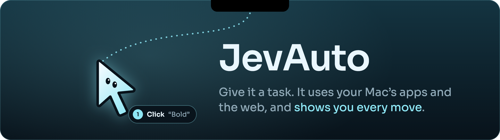
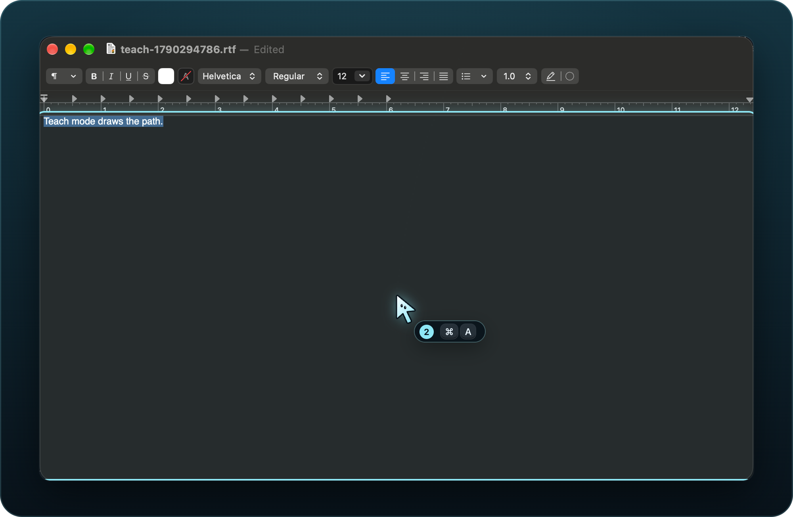
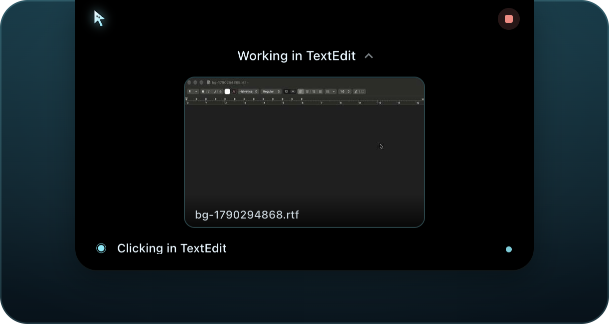

<a name="top"></a>

<p align="center">
  
</p>

<p align="center">JevAuto does tasks in your Mac's apps and on the web, and a cursor character shows you every step.</p>

<p align="center">
  <a href="#features">Features</a> ·
  <a href="#quick-start">Quick start</a> ·
  <a href="#usage">Usage</a> ·
  <a href="#claude-code">Claude Code</a> ·
  <a href="docs/superpowers/specs/2026-09-24-jevauto-design.md">Design</a>
</p>

<p align="center"><sub>macOS 26 or later on Apple silicon · early development, built from source</sub></p>

<p align="center">
  
</p>

<a name="features"></a>

## ✦ Features

**Watch every step.** The cursor travels to each target and acts the step out: a ripple for a click, the text typing out beside it, keycaps for a shortcut. Choose Instant, Balanced or Cinematic, or Teach, which draws the path and numbers each step so you can repeat it.

**The island keeps you posted.** The notch narrates what JevAuto is doing and opens to show the last few steps. When the window it works in is covered or on another Space, the island shows a picture of it, updated each step. Stop is always one click away.

<p align="center">
  
</p>

**Mac apps and the web in one task.** Mac apps are driven through [Cua Driver](https://github.com/trycua/cua): in front of you in Watch mode (the default), or in the background while you keep working. Websites open in JevAuto's own Chrome profile. One task can read a web page and then write into a Mac app.

**You decide what goes out.** Steps that send, buy, delete or submit a form wait for your OK. You can allow once, allow for the task, always allow an app to come forward, or edit text before it is typed. Full auto, off by default, lets JevAuto answer its own questions. JevAuto never types into password fields and never acts in password managers, security prompts or your everyday browsers.

**Pick the brain.** Run tasks on GPT-6 Sol, Gemini 3.8 Flash or Claude Opus 5.5, or let [Claude Code drive JevAuto](#claude-code). When a run gets past a problem, it can save a one-line tip for that app, and later runs in that app see it.

<a name="quick-start"></a>

## ↓ Quick start

You need:

- macOS 26 or later on Apple silicon (JevAuto is developed on macOS 27)
- Node 24 or later, and pnpm 11 through Corepack
- Xcode Command Line Tools (`xcode-select --install`) and Google Chrome
- An Apple Development signing identity (`security find-identity -v -p codesigning` lists yours)
- An API key for at least one model provider

```sh
git clone https://github.com/vhicktour/JevAuto.git
cd JevAuto
corepack enable
pnpm install
pnpm prepare:cua        # stages and signs the pinned Cua Driver SDK
```

Put your keys in `.env.local` at the top of the checkout. One provider is enough:

```sh
OPENAI_API_KEY=...
GEMINI_API_KEY=...
ANTHROPIC_API_KEY=...
ANTHROPIC_WORKSPACE_ID=...    # only for an Anthropic organisation key
TYPESAFE_API_KEY=...          # optional: Jev, which only logs its guesses for now
```

Build and open the signed dev app, JevAuto Dev:

```sh
JEVAUTO_DEV_IDENTITY="Your Name (TEAMID)" pnpm app:dev
```

Give JevAuto Dev **Accessibility** and **Screen Recording** in System Settings (the app's Settings → Mac access opens the right panes), then quit and reopen it. The window shows both as Allowed. You can also enter keys in Settings, where they are stored encrypted with your Mac's Keychain.

<details>
<summary>No signing identity?</summary>

`pnpm dev` runs the app unsigned from the terminal. macOS then gives the permissions to your terminal app instead of JevAuto, so grant Accessibility and Screen Recording to the terminal.

</details>

<a name="usage"></a>

## ⌘ Usage

Type a task in the JevAuto window and press Return, or press ⌃⌥Space from any app:

> Open example.com and type its main heading into my TextEdit document.

JevAuto opens the page in its browser, reads “Example Domain”, switches to TextEdit and types it, narrating each step on the island. This task took 6 turns and about 23 seconds on GPT-6 Sol in testing.

While it works, type more and choose **Steer** to add to the running task, or **Queue** to run it next. **Stop** on the island ends the run at once.

To run a task from Terminal instead:

```sh
pnpm agent "Open example.com and read me the main heading" --watch --model gemini-3.8-flash
```

`--max-actions`, `--minutes` and `--budget` (dollars) set the run's limits, and `--exclude` names an app it must not touch.

<a name="claude-code"></a>

## ⇄ Claude Code

JevAuto includes a Claude Code plugin. With it, Claude Code does the thinking and JevAuto does the clicking: Claude looks at one window at a time, and every action goes through JevAuto's cursor, approvals, Full auto setting and Stop. No JevAuto model is called.

```sh
claude plugin marketplace add vhicktour/JevAuto
claude plugin install jevauto@jevauto
```

In JevAuto, turn on **Settings → Claude Code**, then restart Claude Code. `claude mcp list` should show `plugin:jevauto:jevauto … ✔ Connected`. Then ask for a task in plain words, for example “Use JevAuto to open Notes and start a checklist with milk, eggs and bread.”

Claude gets `look`, `windows`, `open_app`, `open_url`, `click`, `type`, `keys`, `scroll`, `drag`, `wait`, `do` (several steps in one call) and `learn` (save a tip for an app). While the switch is on, any app running as you can reach JevAuto through its socket at `~/.jevauto/mcp.sock`.

## △ Good to know

- JevAuto works in one window at a time. A covered window still works; the island shows its picture.
- Sign in to websites once in JevAuto's own Chrome profile. JevAuto does not use your everyday browser.
- JevAuto never types passwords. When a site needs one, it asks you to type it.
- Claude Opus 5.5 support is built and unit-tested but has not been run live yet.
- No signed release has been published yet. `pnpm release` builds one and notarizes it when a `jevauto-notary` profile exists.

---

<p align="center">
  <a href="docs/superpowers/specs/2026-09-24-jevauto-design.md">Design spec</a> ·
  <a href="docs/superpowers/plans">Phase plans</a> ·
  <a href="THIRD-PARTY.md">Third-party notices</a> ·
  <a href="#top">Back to top</a>
</p>

<p align="center"><sub>No license has been chosen yet: <code>package.json</code> marks the project <code>UNLICENSED</code>.</sub></p>
